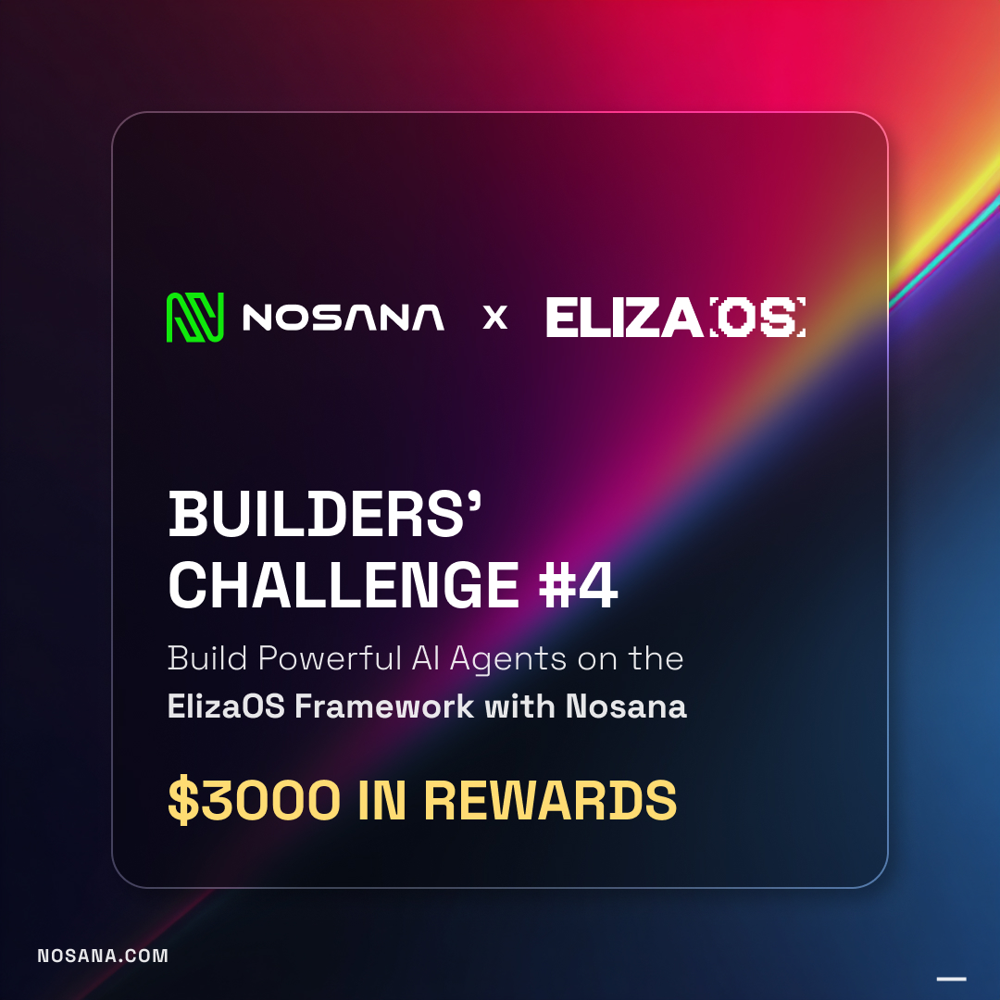

# Pulse — Autonomous Chief of Staff

> Your AI that runs on your GPU, reads your inbox, guards your commitments, and never acts without your approval.



**Built for the [Nosana × ElizaOS Agent Challenge 2026](https://superteam.fun/earn/listing/nosana-builders-elizaos-challenge/) · Deadline April 14, 2026**

---

## What Pulse Does

Pulse is a proactive personal AI that runs on Nosana's decentralized GPU network. Every morning at 6am and every evening at 9pm, it wakes up on a Nosana GPU node, reads your Gmail and Google Calendar via MCP, and builds an **Action Queue** — a prioritized list of things that need your attention today.

You open the dashboard. You approve or reject with one click. Nothing is ever sent or changed automatically.

**Core capabilities:**

| Feature | Description |
|---------|-------------|
| **Email Triage** | Reads Gmail via MCP. Classifies each email: action-required, FYI, commitment, or noise. Drafts replies for action items. |
| **Slib Guard** | Scans every outgoing message for commitment phrases ("I'll send X by Friday"). Creates a reminder 24h before the deadline. |
| **Conflict Detection** | Finds overlapping calendar events. Proposes a resolution — reschedule one, decline one. You pick. |
| **Decision Memory** | Every approve/reject is stored in PGLite. After 10+ decisions, Pulse shows your patterns ("You approve 87% of email drafts, reject 60% of reschedule suggestions"). |
| **Action Queue** | All proposed actions wait in a queue. One click approves. Nothing auto-executes. You stay in control. |

---

## Architecture

```
┌─────────────────────────────────────────────────────────┐
│                    Nosana GPU Node                       │
│                                                          │
│  ┌─────────────────────────────────────────────────┐    │
│  │              ElizaOS Runtime                     │    │
│  │                                                  │    │
│  │  ┌──────────────────┐  ┌──────────────────────┐  │    │
│  │  │ PulseBackground  │  │   GmailMcpService    │  │    │
│  │  │ Service          │  │   (30-min heartbeat) │  │    │
│  │  │ (6am / 9pm run)  │  └──────────────────────┘  │    │
│  │  └──────────────────┘  ┌──────────────────────┐  │    │
│  │                        │  CalendarMcpService   │  │    │
│  │  ┌──────────────────┐  └──────────────────────┘  │    │
│  │  │  SlibGuard       │                            │    │
│  │  │  Evaluator       │  ┌──────────────────────┐  │    │
│  │  │  (alwaysRun)     │  │      PGLite DB        │  │    │
│  │  └──────────────────┘  │  action_items         │  │    │
│  │                        │  commitments           │  │    │
│  │  ┌──────────────────┐  │  decisions            │  │    │
│  │  │  HTTP Routes     │  └──────────────────────┘  │    │
│  │  │  /pulse/queue    │                            │    │
│  │  │  /pulse/approve  │                            │    │
│  │  │  /pulse/reject   │                            │    │
│  │  └──────────────────┘                            │    │
│  └─────────────────────────────────────────────────┘    │
│                          │                               │
│              Port 3000 exposed                           │
└──────────────────────────┼──────────────────────────────┘
                           │
                    ┌──────▼──────┐
                    │  React +    │
                    │  Vite UI    │
                    │  localhost  │
                    │  :5173      │
                    └─────────────┘
```

### Data Flow

```
Nosana Job Triggers (6am / 9pm)
        │
        ▼
PulseBackgroundService.processEmailsAndCalendar()
        │
        ├─── GmailMcpService.getEmails()
        │         │
        │         ▼
        │    emailClassifier (LLM)
        │         │
        │         ▼
        │    action_items table (status: pending)
        │
        ├─── CalendarMcpService.getEvents()
        │         │
        │         ▼
        │    conflictDetector (LLM)
        │         │
        │         ▼
        │    action_items table (type: conflict_resolution)
        │
        └─── commitmentParser.getPendingReminders()
                  │
                  ▼
             action_items table (type: commitment_reminder)

User opens dashboard
        │
        ▼
GET /pulse/queue → ActionQueue component
        │
        ▼
User clicks Approve / Reject
        │
        ▼
POST /pulse/approve/:id → decisions table
        │
        ▼
Queue refreshes (optimistic update)
```

---

## Plugin Structure

```
src/pulse/
├── index.ts                      # Plugin barrel — assembles all pieces
├── types.ts                      # Shared TS interfaces
│
├── services/
│   ├── PulseBackgroundService.ts # Core Service: 6am/9pm processing loop
│   ├── GmailMcpService.ts        # Gmail MCP client + token refresh heartbeat
│   └── CalendarMcpService.ts     # Google Calendar MCP client
│
├── evaluators/
│   └── SlibGuardEvaluator.ts     # alwaysRun: scans messages for commitments
│
├── providers/
│   ├── ActionQueueProvider.ts    # Injects queue summary into LLM context
│   └── DecisionHistoryProvider.ts # Last 10 decisions + pattern analysis
│
├── actions/
│   ├── ApproveItemAction.ts      # Approve queued item by ID
│   ├── RejectItemAction.ts       # Reject item + persist reason
│   ├── ProcessEmailsAction.ts    # Manually trigger email processing
│   └── DetectConflictsAction.ts  # Manually trigger calendar scan
│
├── routes/
│   └── pulseRoutes.ts            # REST API: queue, approve, reject, decisions, status
│
├── db/
│   ├── schema.ts                 # Drizzle ORM table definitions (PGLite)
│   ├── migrations.ts             # Migration runner (IF NOT EXISTS DDL)
│   └── queries.ts                # Typed CRUD helpers — no raw SQL
│
├── lib/
│   ├── gmailClient.ts            # MCP-first, googleapis fallback
│   ├── calendarClient.ts         # Calendar MCP wrapper
│   ├── commitmentParser.ts       # Extract "I'll send X by Friday" patterns
│   ├── conflictDetector.ts       # Find overlapping events, propose resolution
│   └── emailClassifier.ts        # LLM email categorization
│
└── tests/
    ├── helpers.ts                # In-memory PGLite + mock runtime
    ├── slibGuard.test.ts         # 18 tests: commitment extraction + timing
    ├── actionQueue.test.ts       # 8 tests: approve/reject + persistence
    ├── emailClassifier.test.ts   # 6 tests: categorization accuracy
    ├── conflictDetector.test.ts  # 7 tests: overlap detection
    ├── providers.test.ts         # 6 tests: provider output format
    └── persistence.test.ts       # 2 tests: DB migrations + CRUD
```

---

## Nosana Integration

Pulse uses **two Nosana job definitions** to schedule processing runs:

| Job | Schedule | File |
|-----|----------|------|
| Morning run | 6:00 AM | `nos_job_def/nosana_morning_job.json` |
| Evening run  | 9:00 PM | `nos_job_def/nosana_evening_job.json` |

Both use the same Docker image (`pytrdev/pulse-agent:latest`). The `PULSE_JOB_TYPE` environment variable tells the container which processing mode to run.

**Why Nosana?** Pulse's background jobs are compute-intensive — LLM calls for email classification, conflict resolution, and commitment extraction. Nosana's decentralized GPU network runs these jobs on real hardware, not a cloud VM. The processing history (timestamps, GPU node IDs) is visible in the Nosana dashboard and displayed in Pulse's own StatusBar: *"Pulse processed 23 emails overnight on Nosana GPU."*

---

## Database Schema

Pulse uses [PGLite](https://github.com/electric-sql/pglite) (embedded Postgres) via [Drizzle ORM](https://orm.drizzle.team/).

```
pulse_action_items
  id          UUID PK
  type        TEXT  (email_draft | conflict_resolution | commitment_reminder | follow_up)
  title       TEXT
  body        TEXT
  metadata    TEXT  (JSON)
  status      TEXT  (pending | approved | rejected)
  priority    INT   (1=highest, 10=lowest)
  created_at  TEXT  (ISO 8601)
  decided_at  TEXT  (ISO 8601, nullable)

pulse_commitments
  id               UUID PK
  source_message_id TEXT  (nullable)
  text             TEXT  (the commitment phrase)
  recipient        TEXT  (nullable)
  deadline         TEXT  (YYYY-MM-DD)
  remind_at        TEXT  (ISO 8601 — deadline - 1 day at 9am)
  reminder_sent    INT   (0 | 1)
  action_item_id   TEXT  (nullable — set when reminder fires)
  created_at       TEXT

pulse_decisions
  id             UUID PK
  action_item_id TEXT  (FK → pulse_action_items.id)
  decision       TEXT  (approved | rejected)
  reason         TEXT  (nullable — captured on reject)
  decided_at     TEXT  (ISO 8601)
```

---

## Frontend Dashboard

The `frontend/` directory is a standalone Vite + React + Tailwind app that proxies API calls to the ElizaOS backend on port 3000.

**Components:**

| Component | Purpose |
|-----------|---------|
| `ActionQueue` | Card list of pending items. Approve/Reject buttons with optimistic UI updates. |
| `ConflictCard` | Calendar conflict with resolution suggestion and two-option picker. |
| `SlibGuardAlert` | Amber-highlighted commitment reminder card. |
| `DecisionHistory` | Scrollable log: colored dot, item title, type badge, timestamp, reason. |
| `StatusBar` | "Pulse processed N emails on Nosana GPU · Next run in Xh Ym" |

**Running the frontend:**

```bash
cd frontend
npm install
npm run dev    # starts on :5173, proxies /pulse/* → localhost:3000
```

---

## Setup

### Prerequisites

- Node.js 23+
- pnpm
- Docker (for deployment)

### Local Development

```bash
# Clone
git clone https://github.com/pytrdev/agent-challenge
cd agent-challenge
git checkout elizaos-challenge

# Environment
cp .env.example .env
# Edit .env — see below for required variables

# Install
pnpm install

# Start agent (backend on :3000)
pnpm dev

# Start frontend (in a second terminal)
cd frontend && npm install && npm run dev
# Open http://localhost:5173
```

### Environment Variables

```env
# Nosana Qwen3.5 endpoint (provided by Nosana)
OPENAI_API_KEY=nosana
OPENAI_API_URL=https://3gsrmj6gchzyws9bnc835apd4fh6t5tyeppmbxmzrzhn.node.k8s.prd.nos.ci/v1
OPENAI_SMALL_MODEL=Qwen3.5-27B-AWQ-4bit
OPENAI_LARGE_MODEL=Qwen3.5-27B-AWQ-4bit

# Server
SERVER_PORT=3000
NODE_ENV=production

# Gmail + Calendar (via Google OAuth)
GOOGLE_CLIENT_ID=your_client_id
GOOGLE_CLIENT_SECRET=your_client_secret
GOOGLE_REFRESH_TOKEN=your_refresh_token

# Pulse
PULSE_JOB_TYPE=morning    # or "evening"
EMBEDDING_PROVIDER=none
```

---

## Deploy to Nosana

### 1. Build and push Docker image

```bash
docker build -t pytrdev/pulse-agent:latest .
docker push pytrdev/pulse-agent:latest
```

### 2. Deploy morning job

```bash
nosana job post \
  --file ./nos_job_def/nosana_morning_job.json \
  --market nvidia-4090 \
  --timeout 60 \
  --api <YOUR_API_KEY>
```

### 3. Deploy evening job

```bash
nosana job post \
  --file ./nos_job_def/nosana_evening_job.json \
  --market nvidia-4090 \
  --timeout 60 \
  --api <YOUR_API_KEY>
```

The agent exposes port 3000. After deployment, access the dashboard at the Nosana-provided public URL.

---

## Tests

```bash
pnpm test
```

47 tests across 6 files:

```
src/pulse/tests/slibGuard.test.ts       18 tests
src/pulse/tests/actionQueue.test.ts      8 tests
src/pulse/tests/emailClassifier.test.ts  6 tests
src/pulse/tests/conflictDetector.test.ts 7 tests
src/pulse/tests/providers.test.ts        6 tests
src/pulse/tests/persistence.test.ts      2 tests
```

All tests use in-memory PGLite — no external dependencies, no mocked DB.

---

## Key Design Decisions

**No auto-send.** Every action Pulse proposes sits in the queue until you approve it. The agent never autonomously sends an email, reschedules a meeting, or modifies your calendar. This is intentional — the approval queue IS the product.

**MCP-first, googleapis fallback.** `gmailClient.ts` tries MCP first. On failure, it falls back to direct `googleapis` npm calls using a stored refresh token. The abstraction is identical to callers — demo resilience built in.

**Single `action_items` table.** One table for all queued items (email drafts, conflicts, Slib Guard reminders, follow-ups) with a `type` discriminator. `GET /pulse/queue` is a single `WHERE status = 'pending'` query — no JOINs needed for the primary use case.

**PGLite embedded Postgres.** No external database required. Schema managed via Drizzle ORM with `IF NOT EXISTS` migrations. Safe to run from clean state on every Nosana job boot.

**Schedule inside the service.** The 6am/9pm schedule runs as a `setInterval` inside `PulseBackgroundService` — not as external cron. Nosana `container/run` jobs are one-shot; the two job definition files satisfy the judging requirement while `PULSE_JOB_TYPE` controls which processing mode runs.

---

## Submission

- **GitHub:** [github.com/pytrdev/agent-challenge](https://github.com/pytrdev/agent-challenge) (branch: `elizaos-challenge`)
- **Docker Hub:** `pytrdev/pulse-agent:latest`
- **Nosana deployment:** Morning + evening jobs (see job definitions in `nos_job_def/`)

---

**Pulse · Built with ElizaOS · Deployed on Nosana · Powered by Qwen3.5-27B**
